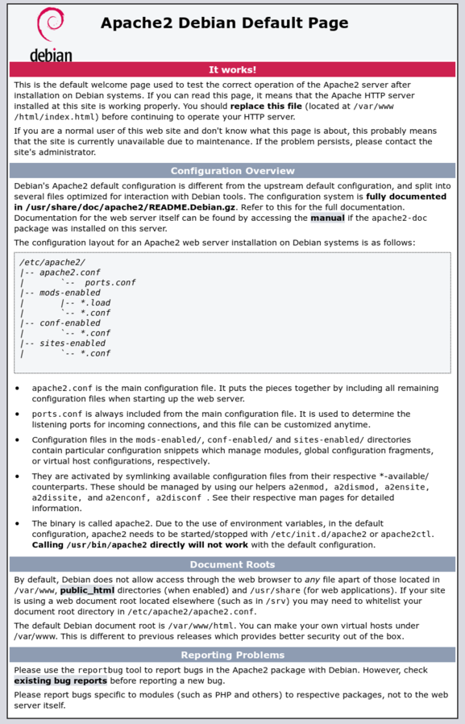
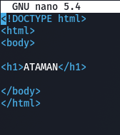
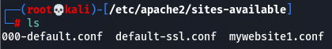
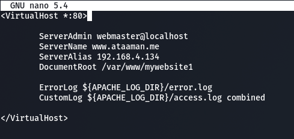
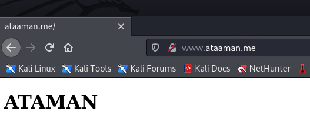

<div id="top"></div>

<!-- PROJECT LOGO -->
<br />
<div align="center">
    
  <h2 align="center">Project 3</h2>
  <h3 align="center">HyperText Transfer Protocol Apache2</h3>
</div>


<!-- TABLE OF CONTENTS -->

  <summary>Table of Contents</summary>
  <ol>
     <li><a href="#Project-description">Project description</a></li>
    <li>
      <a href="#Part-I">Part I : Apache2 server configuration</a>
         <ul>
              <li><a href="#Installation">Install the Apache2 server</a></li>
              <li><a href="#verification-the-configuration-files">Verify the configuration files and identify the role of each file:</a></li>
                  <ul> 
                      <li><a href="#role-of-each-file">apache2.conf, envvars, ports.conf, conf.d, sites-available, sites-enabled, mods-available and mods-enabled</a></li>
                  </ul>
              <li><a href="#Website-configuration">Website configuration.</a></li>       
           </ul>
        </li>
        <li><a href="#Part-II">Part II: HTTP and DNS</a>
            <ul>      
              <li><a href="#Registration-of-the-website-in-zone-files-of-the-DNS">Reconfigure the zone-files (DNS)</a></li>
              <li><a href="#Testing-the-access-by-ADDR-&-NS">Test the access (addr/ns)</a></li>
            </ul>
           </li> 
        <li><a href="#Part-III">Part III: Secure a repository</a>
             <ul>      
              <li><a href="#Access-filtering-at-users-level">Access filtering at user's level</a></li>
                 <ul>      
                   <li><a href="#Modification-the-configuration">Modification the configuration</a></li>
                   <li><a href="#Create-accounts">Create accounts (Apache provides a tool to easily generate encrypted passwords)</a></li>
                 <ul>
                   <li><a href="#Create-a-password-for-the-admin-account">Create a password for the admin account</a></li>
                   <li><a href="#Verify-the-encrypting-of-the-username-and-the-password">Verify the encrypting of the username and the password</a></li>
                     </ul>
                 </ul>
              <li><a href="#Test-the-access-to-the-website">Test the access to the website, what do you notice?</a></li>
              <li><a href="#Check-if-the-password-is-encrypted">Check if the password is encrypted at the level of transfer from the client to the server</a></li>
              <li><a href="#What-is-the-solution">What is the solution?</a></li>
            </ul>
        </li>
        <li><a href="#Part-IV">Part IV: Configuration with .htaccess</a>
          <ul>      
             <li><a href="#Configure-Apache-with__htaccess">Configure Apache with .htaccess.</a></li>
               <ul>      
                <li><a href="#Authorize-the-modification">Authorize the modification</a></li>
                <li><a href="#Create-a-file-named-htaccess">Create a file named “.htaccess” in/var/www/mywebsite2/.</a></li>
                <li><a href="#Configure-the-htaccess">Configure the .htaccess.</a></li>
                <li><a href="#Create-the-digest_users-file">Create the digest-users file.</a></li>
              </ul>
             <li><a href="#Check-if-the-password-is-encrypted">Check if the password is encrypted</a></li>
          </ul>
        </li> 
        <li><a href="#Part-V">Part V: Personal Directories</a>
            <ul>      
              <li><a href="#Create-a-user">Create a user</a></li>
              <li><a href="#Each-user-must-have-a--public_html--folder-in-their-home-directory">Each user must have a “public_html” folder in their home directory</a></li>
            </ul>
         </li> 
   </ol>


# Project description:

>  Apache is an open-source web server that powers a large number of websites
> around the world. Its official name is Apache HTTP Server and it is maintained
> and developed by the Apache Software Foundation.
> 
>  Apache allows website owners to provide content on the web, hence the name
> “web server”. It is one of the oldest and most reliable web servers with a first
> version released over 25 years ago, in 1995.
> 
>  When a user wants to visit a website, they type a domain name (or IP address)
> in the browser’s bar. Then the web server delivers the requested files by acting as
> a virtual delivery agent.

# Part-I

## Installation
```sh
sudo apt install apache2 -y
```
That’s it, Apache is installed in your Kali Linux now you have to start the service using this command: 
```sh
sudo service apache2 start
```
Now you can check the status of the Apache service using this command:
```sh
sudo service apache2 status
```

## verification-the-configuration-files

To verify that apache server working correctly in Kali Linux, open your browser, type your server IP address or domain name `http://YOUR_IP_OR_DOMAIN/` and you will see the default Apache welcome page as shown below: 

   <p align="center">
     
   </p>

## role-of-each-file

In Kali Linux, the Apache configuration files are stored in the `/etc/apache2` directory:

apache configuration files

<p align="center">
     
   </p>

Here is a brief description of the files in this directory:

  * apache2.conf : the main Apache2 configuration file that contains settings global to Apache.

  * envvars : a file where Apache environment variables are set.

  * ports.conf – a configuration file that houses the directives that determine the TCP ports Apache is listening on.
  
  * conf.d: This directory is used for controlling specific aspects of the Apache configuration. For example, it is often used to define SSL configuration and default security choices.
  
  * sites-available – a directory that has configuration files for Apache Virtual Hosts. Virtual Hosts allow Apache2 to be configured for multiple sites that have separate configurations.
  
  * sites-enabled – a directory that contains symlinks to the /etc/apache2/sites-available directory.
  
  * mods-available : a directory that contains configuration files to both load modules and 
configure them.

  * mods-enabled – a directory that holds symlinks to the files in /etc/apache2/mods-available.

## Website-configuration
The first thing we're going to do is create two directories
(`mywebsite1` and `mywebsite2`) with the command: 

```sh
sudo mkdir  /var/www/mywebsite1
```

```sh
sudo mkdir  /var/www/mywebsite2
```

Then we're going to create two pages in each directory
(`index.html`) with the command: 

```sh
sudo nano  /var/www/mywebsite1/html.index
```
```sh
sudo nano  /var/www/mywebsite2/html.index
```
> Note : we're going to focus on the first page only in the rest of the project

   <p align="center">
     
   </p>
   

After that we create the conf-file (`mywebsite1.conf`)
   <p align="center">
     
   </p>
   
Where we put our settings for the good fonctionality of the manipulated website
   <p align="center">
     
   </p>
   
And then we avtivate the vhost :
```sh
sudo a2ensite mywebsite1.conf
```
> Wich create a symlink from site-available to site-enabled

In order to update the new configuration we simply reload the service :
```sh
sudo systemctl reload apache2
```

And finally we're going to test our conf :
   <p align="center">
     
   </p>
   


<p align="right">(<a href="#top">back to top</a>)</p>

# Part-II

## Registration-of-the-website-in-zone-files-of-the-DNS
## Testing-the-access-by-ADDR-&-NS

<p align="right">(<a href="#top">back to top</a>)</p>

# Part-III

## Access-filtering-at-users-level
## Modification-the-configuration
## Create-accounts
### Create-a-password-for-the-admin-account
### Verify-the-encrypting-of-the-username-and-the-password

<p align="right">(<a href="#top">back to top</a>)</p>

## Test-the-access-to-the-website
## Check-if-the-password-is-encrypted
## What-is-the-solution

<p align="right">(<a href="#top">back to top</a>)</p>

# Part-IV

> The .htaccess files are Apache configuration files, allowing to define rules in
> a directory and in all its subdirectories (which do not have such a file inside). They
> can be used to protect a directory with a password, to change the name or
> extension of the index page, or to prohibit access to the directory.
> 
> The .htaccess file is placed in the directory in which it must act. It thus acts
> on the permissions of the directory that contains it and of all its sub-directories.
> Another .htaccess file can be placed in a subdirectory of a directory already
> controlled by an .htaccess file. The .htaccess file in the parent directory remains
> in “activity” until the functionality is rewritten.

## Configure-Apache-with__htaccess
### Authorize-the-modification
### Create-a-file-named-htaccess
### Configure-the-htaccess
### Create-the-digest_users-file
## Check-if-the-password-is-encrypted

<p align="right">(<a href="#top">back to top</a>)</p>

# Part-V
  
## Create-a-user
## Each-user-must-have-a--public_html--folder-in-their-home-directory  
<p align="center">
     
   </p>

<p align="right">(<a href="#top">back to top</a>)</p>

Out Team - [AIT EL KADI Ilyas](https://github.com/IlyasKadi) - [AZIZ Oussama](https://github.com/ATAMAN0)

Project Link: [https://github.com/IlyasKadi/Domain-Name-System-Protocol](https://github.com/IlyasKadi/Domain-Name-System-Protocol)

<p align="right">(<a href="#top">back to top</a>)</p>
